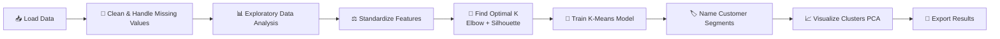

# Kmeans-cluster-shop-customer-data

🛍️ Shop Customer Segmentation using K-Means Clustering

# 🛍️ Shop Customer Segmentation using K-Means Clustering

### Turning raw shopping data into smart, actionable customer personas 🎯

---

## 🌟 What is this project?

Ever wondered how shopping malls, e-commerce sites, or retail brands know exactly who to target with what offer? 🤔

This project uses **K-Means Clustering** — an unsupervised machine learning algorithm — to automatically group **2,000 shop customers** into **5 meaningful segments** based on their age, income, spending behavior, work experience, and family size.

No labels. No manual sorting. Just pure pattern discovery. ✨

> 💡 In short: Give it customer data → it tells you *who your customers really are*.

---

## 🧠 Why K-Means Clustering?

- Instead of manually guessing customer types, the algorithm **discovers natural groups** on its own
- Instead of one-size-fits-all marketing, you get **personalized, segment-based** strategy
- Instead of static rules like "age > 40 = senior", grouping is **data-driven** across multiple features at once

---

## 🗂️ Dataset

- 📄 File: `Customers.csv`
- 👥 Records: 2,000 customers
- 📊 Columns (8): `CustomerID`, `Gender`, `Age`, `Annual Income`, `Spending Score`, `Profession`, `Work Experience`, `Family Size`

---

## 🔍 The Workflow (at a glance)

---

## 🏆 The 5 Customer Segments Discovered

- **Cluster 0 — 👨‍👩‍👧 High-Income Young Families:** High earners with families — great for premium/family bundle offers
- **Cluster 1 — 🎉 Young Active Spenders:** Young customers with high spending scores — perfect for trendy/lifestyle marketing
- **Cluster 2 — 💼 Mid-Age Experienced Savers:** Balanced income & spend, more work experience — value-driven shoppers
- **Cluster 3 — 🧓 Senior Moderate Spenders:** Older customers with steady, moderate spending habits
- **Cluster 4 — 💰 Low-Income Conservative:** Budget-conscious customers — best suited for discounts & loyalty programs

---

## ⚙️ Tech Stack

- **Language:** Python
- **Data Handling:** Pandas, NumPy
- **Visualization:** Matplotlib, Seaborn
- **Machine Learning:** scikit-learn
- **Environment:** Jupyter Notebook

---

## 📁 Repository Structure
